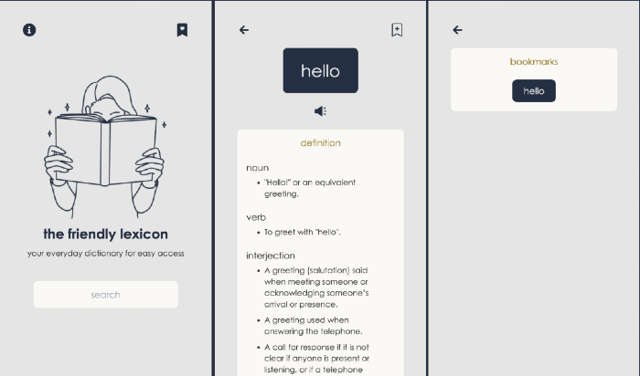

# The Friendly Lexicon

This app was created as a hack project for the Post Graduate Program at School of Applied Technology </salt>.

The main focus of this project was to learn Tailwind CSS and practise developing the frontend and design of an app. The app is called the friendly lexicon because it was designed to be accessible to people with dyslexia and/or color blindness.

## Tech Stack
React + TypeScript + Tailwind CSS

## Get Started
Clone this repository and run the following commands
- npm i  
- npm start